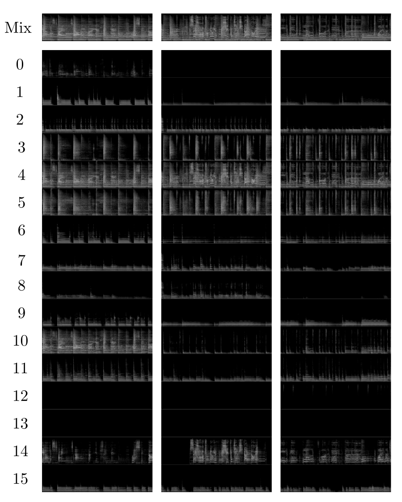
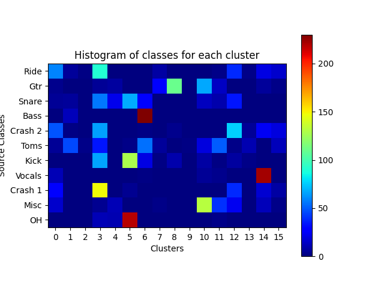

# Self-Supervised Music Source Separation Using Vector-Quantized Source Category Estimates

**Abstract**  
Music source separation is focused on extracting distinct sonic elements from composite tracks. Historically, many methods have been grounded in supervised learning, necessitating labeled data, which is occasionally constrained in its diversity. More recent methods have delved into N-shot techniques that utilize one or more audio samples to aid in the separation. However, a challenge with some of these methods is the necessity for an audio query during inference, making them less suited for genres with varied timbres and effects. This paper offers a proof-of-concept for a self-supervised music source separation system that eliminates the need for audio queries at inference time. In the training phase, while it adopts a query-based approach, we introduce a modification by substituting the continuous embedding of query audios with a Vector Quantized Variational Autoencoder (VQ-VAE). Trained end-to-end with up to N classes as determined by the VQ-VAE's codebook size, the model seeks to effectively categorize instrument classes. During inference, the input is partitioned into N sources, with some potentially left unutilized based on the mix's instrument makeup. This methodology suggests an alternative avenue for considering source separation across diverse music genres.

## Mel-Spectrograms of Separated Sources

We show mel-spectrograms of example input mixes and separated outputs. For each separation from 0 to 15 the Generator is conditioned on the corresponding quantized embedding. By cross-referencing this visualization with the clustering histogram shown below, it is possible to recognize specific sources.

  

## Source Clustering

We also show the distribution of the different classes of the test set for each quantized embedding found by the system.

  

## Audio Examples

We finally present some audio samples of separations produced by the system. By cross-referencing the cluster index with the histogram shown above, it is possible to recognize the class of sources characteristic of each cluster.

### Example 0

Mix
<audio src="audio/4/mix.wav" controls ></audio>
Cluster 3 (Drums)
<audio src="audio/4/3.wav" controls ></audio>
Cluster 5 (Drums)
<audio src="audio/4/5.wav" controls ></audio>
Cluster 6 (Bass/Toms)
<audio src="audio/4/6.wav" controls ></audio>
Cluster 12 (Crash)
<audio src="audio/4/12.wav" controls ></audio>
Cluster 14 (Vocals)
<audio src="audio/4/14.wav" controls ></audio>

### Example 1

Mix
<audio src="audio/5/mix.wav" controls ></audio>
Cluster 3 (Drums)
<audio src="audio/5/3.wav" controls ></audio>
Cluster 5 (Drums)
<audio src="audio/5/5.wav" controls ></audio>
Cluster 6 (Bass/Toms)
<audio src="audio/5/6.wav" controls ></audio>
Cluster 8 (Guitar)
<audio src="audio/5/8.wav" controls ></audio>

### Example 2

Mix
<audio src="audio/3/mix.wav" controls ></audio>
Cluster 3 (Drums)
<audio src="audio/3/3.wav" controls ></audio>
Cluster 5 (Drums)
<audio src="audio/3/5.wav" controls ></audio>
Cluster 10 (Misc)
<audio src="audio/3/10.wav" controls ></audio>
Cluster 14 (Vocals)
<audio src="audio/3/14.wav" controls ></audio>

### Example 3

Mix
<audio src="audio/6/mix.wav" controls ></audio>
Cluster 3 (Drums)
<audio src="audio/6/3.wav" controls ></audio>
Cluster 5 (Drums)
<audio src="audio/6/5.wav" controls ></audio>
Cluster 6 (Bass/Toms)
<audio src="audio/6/6.wav" controls ></audio>
Cluster 12 (Crash)
<audio src="audio/6/12.wav" controls ></audio>
Cluster 14 (Vocals)
<audio src="audio/6/14.wav" controls ></audio>

### Example 4

Mix
<audio src="audio/0/mix.wav" controls ></audio>
Cluster 6 (Bass/Toms)
<audio src="audio/0/6.wav" controls ></audio>
Cluster 8 (Guitar)
<audio src="audio/0/8.wav" controls ></audio>
Cluster 14 (Vocals)
<audio src="audio/0/14.wav" controls ></audio>

### Example 5

Mix
<audio src="audio/1/mix.wav" controls ></audio>
Cluster 3 (Drums)
<audio src="audio/1/3.wav" controls ></audio>
Cluster 5 (Drums)
<audio src="audio/1/5.wav" controls ></audio>
Cluster 8 (Guitar)
<audio src="audio/1/8.wav" controls ></audio>
Cluster 12 (Crash)
<audio src="audio/1/12.wav" controls ></audio>
Cluster 14 (Vocals)
<audio src="audio/1/14.wav" controls ></audio>

